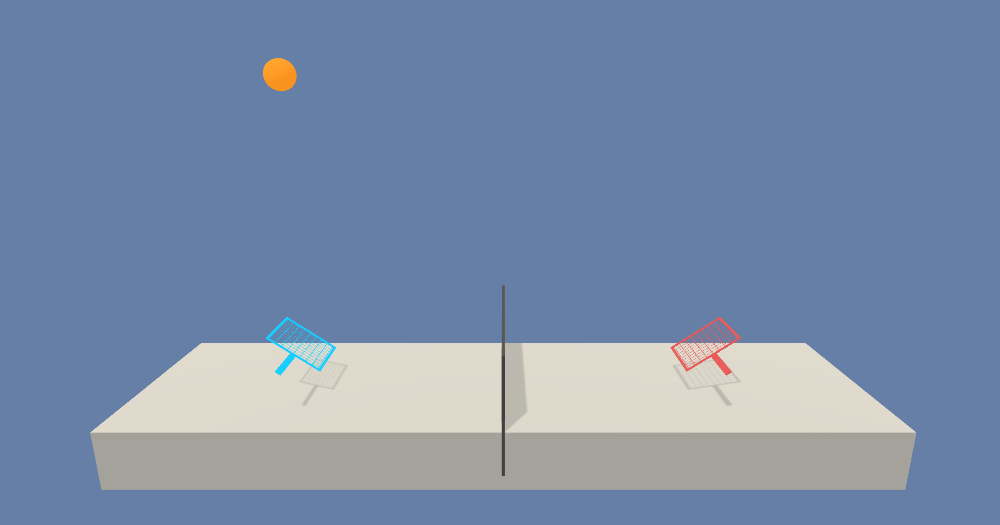

# RL-Multi-Agent-Tennis-Unity
Repository for the Udacity RL Specialization third project Collaboration and Competition using Multi Agent methods.

# Project overview
This project has the objective to train a pair of agents to play tennis, collaborating with each other to keep the ball in play.

## Enviroment & Task
The Tennis environment in Unity ML-Agents provides a challenging and engaging platform for training two cooperative agents in a game of tennis. Each agent controls a racket with the objective of keeping the ball in play by bouncing it over the net, receiving a reward of +0.1 for every successful hit, while incurring a penalty of -0.01 if the ball hits the ground or goes out of bounds. The agents perceive their environment through an 8-variable observation space that includes the position and velocity of both the ball and racket. With two continuous actions available, agents can move toward or away from the net and jump to hit the ball. The task is episodic, and the environment is considered solved when the agents achieve an average score of +0.5 over 100 consecutive episodes, with the score being the maximum reward obtained by either agent in each episode.


<div align="center">
    
</div>

# Usage

## Installing the environment

To install the env, select the environment that matches your operating system:

- [Linux](https://s3-us-west-1.amazonaws.com/udacity-drlnd/P3/Tennis/Tennis_Linux.zip)
- [Mac OSX](https://s3-us-west-1.amazonaws.com/udacity-drlnd/P3/Tennis/Tennis.app.zip)
- [Windows (32-bit)](https://s3-us-west-1.amazonaws.com/udacity-drlnd/P3/Tennis/Tennis_Windows_x86.zip)
- [Windows (64-bit)](https://s3-us-west-1.amazonaws.com/udacity-drlnd/P3/Tennis/Tennis_Windows_x86_64.zip)

The Github Repo already contains the environment for MacOS. If you are using another OS, you must download the environment and place it in the folder `RL-MULTI-AGENT-TENNIS-UNITY/`.

## Training
To train the agent you must open the notebook `Tennis-Train.ipynb` and run all the cells. The agent will be trained and the weights will be saved in the root folder of the project.


## Visualizing trained agent
To visualize the trained agent you must open the notebook `Play.ipynb` and run all the cells.

# Dependencies
The dependencies are listed in the file `requirements.txt` in the folder `python/`. To install them you can run the following command:

```bash
cd python
pip install .
```

It is highly recommended to use a virtual environment to install the dependencies. you can do this by running the following commands:

	- Linux or Mac:
	```bash
	conda create --name drlnd python=3.6
	source activate drlnd
	```
	- Windows:
	```bash
	conda create --name drlnd python=3.6
	activate drlnd
	```


# References
- [Udacity Deep Reinforcement Learning Nanodegree](https://www.udacity.com/course/deep-reinforcement-learning-nanodegree--nd893)
- [DDPG paper](https://arxiv.org/pdf/1509.02971.pdf)
- [D4PG paper](https://arxiv.org/pdf/1804.08617.pdf)
- [MADDPG paper](https://arxiv.org/pdf/1706.02275.pdf)
