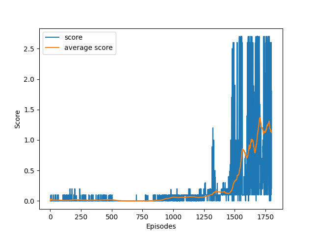
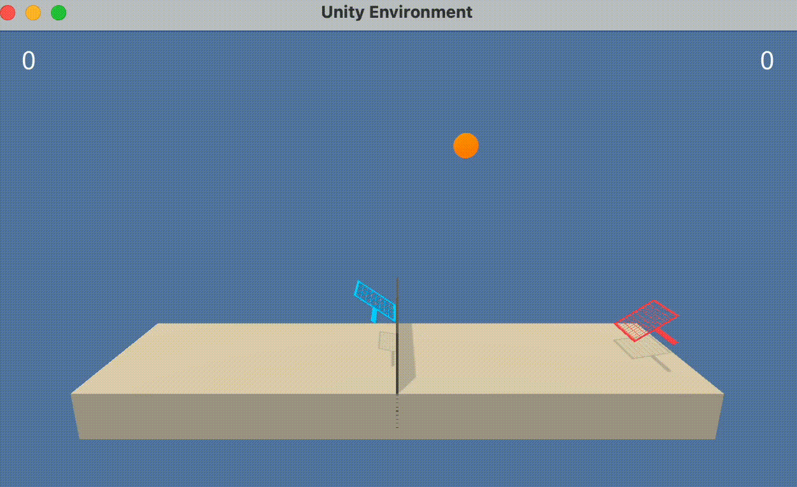

# Collaboration and Competition using Multi Agent methods
## Objective

The primary objective of this project is to develop and implement a successful Multi-Agent Deep Deterministic Policy Gradient (MADDPG) algorithm to train two cooperative agents in the Unity ML-Agents Tennis environment. The agents must work together to maximize their rewards by keeping the ball in play, ensuring that it is consistently hit over the net. The environment is considered solved when the agents achieve an average score of +0.5 over 100 consecutive episodes, with the score being the maximum reward obtained by either agent in each episode. The success of the MADDPG implementation will be measured by the number of episodes required to reach the target average score and the agents' ability to maintain and improve their performance beyond that point. The report will provide a detailed analysis of the training process, including the hyperparameters, network architecture, and learning algorithm, as well as insights into the agents' behavior and potential improvements for future work.

# The Environment

    

## State Space
The state space in the Tennis environment comprises eight variables that represent the position and velocity of the ball and racket for each agent. These variables provide each agent with a local observation of the environment, allowing them to make informed decisions about their actions based on the current state. The state space provides a continuous and high-dimensional representation of the environment, posing a challenge for the agents to learn effective policies.

## Action Space
The action space in this environment is continuous and consists of two actions available to each agent. The first action corresponds to the movement of the agent toward or away from the net, while the second action represents jumping. This continuous action space allows for more nuanced and precise control of the agents' rackets, enabling them to learn a wide range of strategies for keeping the ball in play.

## Task Type
The task in the Tennis environment is episodic and cooperative, as the two agents must work together to maximize their combined rewards. The agents receive a reward of +0.1 for every successful hit over the net, and a penalty of -0.01 if the ball hits the ground or goes out of bounds. The environment is considered solved when the agents achieve an average score of +0.5 over 100 consecutive episodes, with the score being the maximum reward obtained by either agent in each episode.

# The Algorithm

## Multi-Agent Deep Deterministic Policy Gradient (MADDPG)
MADDPG is an extension of the Deep Deterministic Policy Gradient (DDPG) algorithm, designed specifically to handle multi-agent reinforcement learning problems. It leverages the power of deep neural networks for function approximation in both the actor and critic components, while addressing the challenges of training multiple agents that interact within a shared environment. The key aspects of MADDPG are detailed below.

### Overview
The MADDPG algorithm consists of multiple DDPG agents, each with their own actor and critic networks. While the actor networks are responsible for generating actions based on the agents' observations, the critic networks estimate the Q-values of state-action pairs. The central idea of MADDPG is to allow the agents to learn their own policies while taking into account the policies of other agents.

### Actor Network
The actor network is a neural network that maps an agent's local observation (state) to a continuous action space. Each agent has its own actor network, which is trained to generate actions that maximize the expected cumulative reward for that agent. The actor network is updated using the policy gradient, which is computed using the gradients of the critic network with respect to the actions.

### Critic Network
The critic network is a neural network that estimates the Q-value of a given state-action pair. In MADDPG, each agent's critic network takes into account not only the agent's own actions and observations but also the actions and observations of all other agents. This centralized training approach allows the agents to learn the value of their actions in the context of the full multi-agent system, providing a more accurate estimate of the true Q-value. The critic network is updated using the temporal difference (TD) error, which is the difference between the estimated Q-value and the target Q-value.

### Training
During the training process, the agents explore the environment by generating actions based on their current policies (actor networks) and a noise process for exploration. The agents then receive rewards and new observations, which are stored in a shared replay buffer. Periodically, the agents sample a batch of experiences from the replay buffer and use them to update their actor and critic networks.

The training process involves two main steps: updating the critic network using the TD error and updating the actor network using the policy gradient. The agents also perform soft updates to their target networks to ensure stable learning. This process continues for a predefined number of episodes or until the environment is considered solved.

### Hyperparameters
The following hyperparameters were to train the model:

- **BUFFER_SIZE**: Set to 1e5, this parameter defines the size of the replay buffer, allowing agents to store and sample from a large number of experiences, thus improving the stability of learning.
- **BATCH_SIZE**: Set to 256, this parameter determines the number of experiences sampled from the buffer during each update, balancing the trade-off between computational efficiency and the diversity of the sampled experiences.
- **UPDATE_FREQ**: Set to 1, this parameter controls how often the neural networks are updated, ensuring that learning occurs at a consistent pace throughout the training process.
- **GAMMA**: Set to 0.99, this discount factor influences the weight of future rewards when computing the target Q-values, promoting a balance between short-term and long-term rewards.
- **TAU**: Set to 1e-3, this parameter controls the rate at which the target networks are updated, providing a stable learning process by gradually incorporating new learned knowledge.
- **LR_ACTOR** and **LR_CRITIC**: Set to 1e-4 and 3e-4, respectively, these learning rates control the speed at which the actor and critic networks are updated during backpropagation, ensuring a stable and efficient learning process.

Regarding noise parameters for exploration:

- **NOISE_REDUCTION_RATE**: Set to 0.99, this parameter determines the rate at which exploration noise is reduced over time, allowing agents to transition from exploration to exploitation as they learn.
- **EPISODES_BEFORE_TRAINING**: Set to 500, this parameter delays the start of training, providing agents with a period of pure exploration to gather initial experiences.
- **NOISE_START** and **NOISE_END**: Set to 1.0 and 0.1, respectively, these parameters define the initial and final levels of exploration noise, enabling a smooth transition from exploration to exploitation during training.

These hyperparameters were chosen based on manual testing with the objective to provide a balance between exploration and exploitation during learning.

### Advantages
MADDPG is particularly well-suited for cooperative multi-agent tasks, as it enables agents to learn policies that account for the actions of other agents. This leads to better coordination and cooperation between agents, which can result in improved overall performance. Additionally, the use of continuous action spaces allows for more precise control and complex strategies, making MADDPG a powerful algorithm for tackling challenging multi-agent reinforcement learning problems.

## Neural Networks Architecture
In this implementation of MADDPG, the neural network architectures for both the actor and critic networks consist of fully connected layers and incorporate batch normalization. The actor network has an input layer, followed by two hidden layers with 256 and 128 neurons, respectively. Batch normalization is applied after each hidden layer, helping to stabilize learning and improve the training process. The output layer has 2 neurons and uses a hyperbolic tangent (tanh) activation function to produce continuous action values. The actor network's parameters are initialized using a uniform distribution.

The critic network starts with an input layer, followed by a hidden layer with 256 neurons. Batch normalization is applied to the output of this layer. The actions are concatenated to the output, and the combined tensor is passed through another hidden layer with 128 neurons. The critic network's output layer has a single neuron, which estimates the Q-value of the given state-action pair. Similar to the actor network, the critic network's parameters are initialized using a uniform distribution.

Both networks employ ReLU activation functions for the hidden layers and use uniform distributions for weight initialization. The inclusion of batch normalization enhances the learning process, enabling efficient training while preserving the ability to learn complex policies and value functions.

# Results
## Scores
The implemented MADDPG algorithm successfully solved the Tennis environment, a cooperative multi-agent task, showcasing its effectiveness in handling complex interactions between agents. The environment was considered solved once the agents achieved an average score of at least 0.5 over 100 consecutive episodes. This threshold was reached after 1539 episodes, with an average score of 0.5065 and a maximum score of 2.6. The agents' performance continued to improve even after solving the environment, reaching an impressive average score of 1.3329 and a maximum score of 2.6 around the 1700th episode.

The results are showcased in the plot bellow:

## Trained Agent
We can also view the agents interacting with the environment after training:

    

# Ideas for Future Work
While the MADDPG algorithm was successful in solving the Tennis environment, there are a few ideas for future work and improvement that could be explored to further to enhance the performance and learning capabilities of the agents:

1. Hyperparameter tuning: Investigate different combinations of hyperparameters such as learning rates, batch sizes, and network architectures to optimize the training process and improve learning efficiency.

2. Experience prioritization: Modify the experience replay mechanism to prioritize experiences based on their temporal-difference error, allowing the agents to focus on more informative samples during training.

3. Attention mechanisms: Incorporate attention mechanisms into the actor and critic networks, allowing the agents to selectively focus on relevant parts of the state or action spaces when making decisions or learning.
